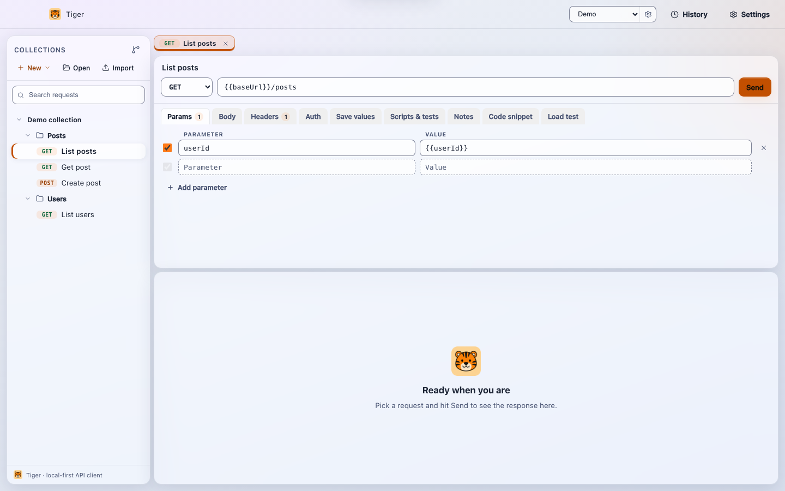
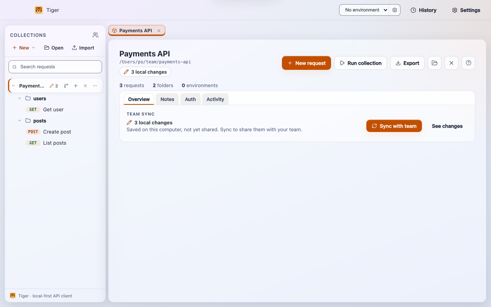
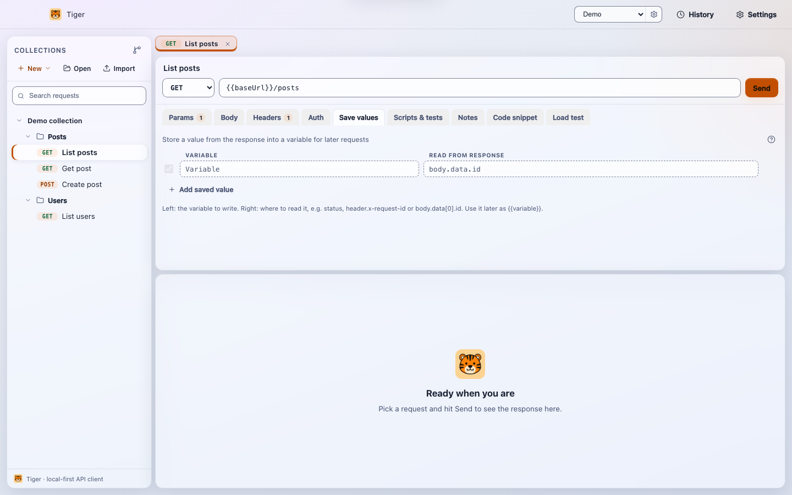

<p align="center">
  
</p>

<h1 align="center">Tiger: free, open source, git-native API client</h1>

<p align="center">
  A local-first Postman, Insomnia and Bruno alternative for macOS, Windows and Linux, with a built-in MCP server. No account, no cloud.
</p>

<p align="center">
  <a href="LICENSE"></a>
  
  <a href="https://github.com/jtaoufik/tiger/releases/latest"></a>
  <a href="https://codecov.io/gh/jtaoufik/tiger"></a>
  <a href="https://github.com/jtaoufik/tiger/actions/workflows/ci.yml"></a>
  <a href="https://buymeacoffee.com/tigerapi"></a>
  <a href="https://www.linkedin.com/in/taoufik-jabbari"></a>
</p>

<p align="center">
  <a href="https://jtaoufik.github.io/tiger/">Website</a> ·
  <a href="https://jtaoufik.github.io/tiger/docs/getting-started/">Docs</a> ·
  <a href="https://jtaoufik.github.io/tiger/compare/">Compare</a> ·
  <a href="https://jtaoufik.github.io/tiger/docs/faq/">FAQ</a> ·
  <a href="https://github.com/jtaoufik/tiger/releases/latest">Download</a>
</p>

**Tiger is a free, open source API client** for testing REST, GraphQL and SOAP APIs. Every request is a plain-text `.tiger` file in a folder you own, so you can commit your collections to Git, branch them and review API changes in pull requests. It works offline, needs no account, and includes an **MCP server** so AI assistants such as Claude and Cursor can list and run your saved requests. If you are looking for a **Postman alternative**, an **offline API client** or a **git-based API client** (like Bruno or Insomnia, with your data kept local), Tiger is built for that.

<p align="center">
  
</p>

## Download

Free, no sign-up. Version 0.7.0.

| Platform | Download | Notes |
|---|---|---|
| Windows | [**Setup installer**](https://github.com/jtaoufik/tiger/releases/latest/download/Tiger-Setup-windows-x64.exe) | Recommended. Adds Start menu and desktop shortcuts. |
| Windows (portable) | [Portable EXE](https://github.com/jtaoufik/tiger/releases/latest/download/Tiger-Portable-windows-x64.exe) | No install. Run it from any folder or USB drive. |
| macOS (Apple Silicon) | [**Download .dmg**](https://github.com/jtaoufik/tiger/releases/latest/download/Tiger-mac-arm64.dmg) | M1 and later. Signed and notarized. |
| macOS (Intel) | [Download .dmg](https://github.com/jtaoufik/tiger/releases/latest/download/Tiger-mac-x64.dmg) | Signed and notarized. |
| Linux | [**AppImage**](https://github.com/jtaoufik/tiger/releases/latest/download/Tiger-linux-x64.AppImage) | Self-contained, updates itself. |
| Linux (Debian, Ubuntu) | [.deb](https://github.com/jtaoufik/tiger/releases/latest/download/Tiger-linux-amd64.deb) | `sudo apt install ./Tiger-linux-amd64.deb` |
| Windows (portable zip) | [Portable zip](https://github.com/jtaoufik/tiger/releases/latest/download/Tiger-Portable-windows-x64.zip) | Unzip and run Tiger.exe. Tip: right-click the zip, Properties, tick Unblock before unzipping. |
| macOS (zip) | [Apple Silicon](https://github.com/jtaoufik/tiger/releases/latest/download/Tiger-mac-arm64.zip) · [Intel](https://github.com/jtaoufik/tiger/releases/latest/download/Tiger-mac-x64.zip) | Unzip and move Tiger.app to Applications. |
| Linux (tar.gz) | [tar.gz](https://github.com/jtaoufik/tiger/releases/latest/download/Tiger-linux-x64.tar.gz) | Extract and run `./tiger-api-client`. |

Installs from the Windows Setup exe, the macOS dmg or zip and the Linux AppImage update themselves in the app (Restart now, or on next quit). The portable exe and zip, the `.deb` and the tar.gz do not: Help > Check for Updates links the new download.

Coming soon: a Microsoft Store listing ("Tiger API Client") and `winget install jtaoufik.Tiger`, both pending review.

See [all downloads and checksums](https://github.com/jtaoufik/tiger/releases/latest) or the [install guide](https://jtaoufik.github.io/tiger/docs/install/). The Windows build can show a SmartScreen "unknown publisher" prompt on first run: click **More info**, then **Run anyway**.

## Features

- **Git-native collections.** One `.tiger` text file per request. Diff, branch and review them like code.
- **Save values.** Capture a status code, a header or a JSON path such as `body.data[0].id` from a response into a variable for the next request.
- **Scripts & tests.** Pre-request and post-response JavaScript, with `tiger.test` assertions that show pass or fail.
- **Collection runner.** Run a whole collection or folder in order, with live results, saved values passed between requests, and a stop button.
- **Load test.** From a request's **Load test** tab, send it many times with set concurrency and get min, max, average, p50 and p95 timings.
- **Team sync.** Share a collection through Git with one **Sync with team** button, a list of your changes, saved versions and side-by-side conflict choices. No Git vocabulary needed, Git users get an Advanced section.
- **AI assistants (MCP).** A built-in MCP server lets Claude, Cursor and other MCP clients list, read and run your requests. See [Connect an AI assistant](#connect-an-ai-assistant-mcp).
- **Environments and secrets.** Named variable sets with `{{variable}}` interpolation in URLs, headers, params, bodies and auth. Secret variables are masked. Dynamic variables: `{{$uuid}}`, `{{$timestamp}}`, `{{$isoTimestamp}}`, `{{$randomInt}}`.
- **Auth and networking.** Bearer, Basic, API key and OAuth 2.0 (client credentials). HTTP, HTTPS and SOCKS proxy. Custom CA bundles and client certificates (mTLS) via PEM pair or PFX/PKCS12.
- **REST, GraphQL and SOAP.** Dedicated GraphQL body with a variables pane. Raw XML bodies for SOAP, and WSDL import that turns each operation into a ready-to-send request.
- **Bodies and responses.** JSON prettify and minify, multipart and file upload, response search (Cmd/Ctrl+F), sandboxed HTML preview and inline images.
- **Import and export.** Import Postman v2.0/v2.1, Insomnia v4, a Bruno folder, OpenAPI 3 or Swagger 2, WSDL, or a pasted curl command. Export to Postman v2.1, OpenAPI 3.0, `.tiger` or curl.
- **Code snippets and cookies.** Turn any request into curl, JavaScript fetch or Python. A persistent cookie jar with cross-origin stripping on redirects.
- **Keyboard-first.** A shortcuts overlay on Cmd/Ctrl+/, a command palette, tab cycling, inline rename and drag and drop. A native File, Edit, Request, View, Window and Help menu on every platform.
- **Accessible.** Readable contrast, full keyboard use, screen reader announcements and Windows High Contrast support.

<p align="center">
  
  
</p>

## Switching from Postman, Insomnia or Bruno

Export from your current tool and import the file into Tiger. Folders, requests, variables and auth carry over, and the result is a folder you can commit.

- [Importing collections](https://jtaoufik.github.io/tiger/docs/importing/): Postman, Insomnia, Bruno, OpenAPI, WSDL and curl.
- [Postman to Tiger migration guide](https://jtaoufik.github.io/tiger/guides/postman-to-tiger/).
- [A free Postman alternative](https://jtaoufik.github.io/tiger/alternatives/postman/), plus comparisons with [Bruno](https://jtaoufik.github.io/tiger/compare/tiger-vs-bruno/), [Insomnia](https://jtaoufik.github.io/tiger/compare/tiger-vs-insomnia/) and [Hoppscotch](https://jtaoufik.github.io/tiger/compare/tiger-vs-hoppscotch/).

## How Tiger compares

Tiger is built around a different set of priorities than most API clients. Here is how those priorities translate in practice.

| Feature | Tiger | Postman | Bruno | Insomnia | Hoppscotch |
|---|---|---|---|---|---|
| Local-first / offline | Yes | Partial - cloud workspace required for most features | Yes | Partial - cloud sync optional but nudged | Partial - self-host or web app |
| Plain-text & git-native | Yes - one `.tiger` file per request | No - proprietary cloud or JSON export | Yes - `.bru` files | No | No |
| No account required | Yes | No | Yes | No | Partial - self-host avoids it |
| Free / per-seat price | Free (MIT) | Free tier; paid from $14/mo per user | Free (MIT) | Free tier; paid from $8/mo per user | Free (MIT, self-host) |
| Open source | Yes | No | Yes | Partial - core open, cloud closed | Yes |
| Built-in MCP server | Yes | No | No | No | No |
| SOAP / WSDL import | Yes - operations become ready-to-send POST requests | Yes | No | No | No |
| OpenAPI & Postman import | Yes | Yes | Yes - Bruno import only | Yes | Yes |
| Pre / post scripting | Yes | Yes | Yes | Yes | Partial |
| Collection runner | Yes | Paid tiers | Yes | Yes | Partial |
| Native macOS / Windows / Linux | Yes | Yes | Yes | Yes | No - web app |
| No traffic telemetry | Yes - requests never leave your machine | No | Yes | No | Partial - depends on hosting |

Pricing and features of other tools change, so check their sites too. Full breakdown: https://jtaoufik.github.io/tiger/compare/

## Why Tiger

- **Collections as plain text in Git.** A collection is a folder of `.tiger` files. Every field is human-readable, so API changes show up as small diffs in pull requests.
- **No account, fully offline, local-first.** Tiger never phones home for your data. Everything lives in a folder you own.
- **MCP server for AI assistants.** Claude, Cursor and any MCP-compatible assistant can list, read and run requests from your collection without leaving the chat.
- **Free and open source.** MIT licensed, no per-seat price, no paid tier gating the basics.

## The `.tiger` format

One request per file. Readable in any editor, friendly to git:

```
meta {
  name: Create post
  seq: 2
}

post {
  url: {{baseUrl}}/posts
}

headers {
  Content-Type: application/json
  ~X-Debug: 1
}

body:json {
  { "title": "Hello from Tiger" }
}

auth:bearer {
  token: {{token}}
}

capture {
  postId: body.id
}
```

A `~` prefix disables a line without deleting it. The `capture` block writes response values into environment variables for the next request in the chain. Environments live in an `environments/` subfolder:

```
meta {
  name: production
}

vars {
  baseUrl: https://api.example.com
  token: abc123
}
```

## Build from source

```bash
npm install
npm run dev        # launch the app in development mode
npm test           # run the test suite
npm run package    # build distributables for your platform
```

Open a collection folder from the sidebar, or try `examples/jsonplaceholder` to see the format in action.

## Connect an AI assistant (MCP)

Tiger ships an MCP server that gives AI clients safe, structured access to a collection. Build it once:

```bash
npm run build:mcp
```

Then register it in your AI client's config. For Claude Desktop, add this to `claude_desktop_config.json`:

```json
{
  "mcpServers": {
    "tiger": {
      "command": "node",
      "args": ["/path/to/tiger/out/mcp/server.mjs", "/path/to/your/collection"]
    }
  }
}
```

The assistant gets four tools: `list_requests`, `list_environments`, `get_request`, and `run_request`. Every response includes the status code, timing, response headers, and a pretty-printed body. Your collection stays on disk; nothing is sent to any third party.

**What it's for** - letting an AI assistant work with the requests your team already keeps in Git, using the real URLs, auth, variables, and environments instead of guessing or pasting curl into the chat:

- **Agentic testing & debugging** - "run the `create-user` request against staging and tell me why it 401s."
- **Chained workflows** - "call `login`, take the token, then run `/me`" (pairs with Tiger's response captures).
- **Inside an AI coding session** - in Claude Code or Cursor, the model exercises your real endpoints through curated, environment-aware requests.
- **Read-only exploration** - "list the requests and summarize what this API does."
- **Smoke checks** - point it at a collection and ask it to run the health checks and flag anything non-2xx.

Full guide: <https://jtaoufik.github.io/tiger/docs/mcp/>

## FAQ

**Is Tiger a free Postman alternative?** Yes. It is MIT licensed, free for personal and commercial use, and covers collections, environments, auth, scripts and tests, a collection runner and Postman import.

**Does Tiger work offline, and do I need an account?** It works fully offline and needs no account. Requests go from your computer straight to the API you call.

**Where are my collections stored?** In a folder you choose, as one `.tiger` text file per request. Put it in any Git repository.

**How does Tiger differ from Bruno?** Both are open source and offline with plain-text collections. Tiger also ships a built-in MCP server, WSDL/SOAP import, client certificates, a Load test tab and Team sync. See the [comparison](https://jtaoufik.github.io/tiger/compare/tiger-vs-bruno/).

**Does Tiger collect my requests?** No. It never records URLs, hostnames, headers or bodies. See [Privacy](#privacy) for the anonymous usage events and how to turn them off.

More answers in the [full FAQ](https://jtaoufik.github.io/tiger/docs/faq/).

## Privacy

Tiger sends anonymous usage analytics by default: app opened, request sent (method and status bucket only), and collection imported (source and count). It never records URLs, hostnames, header values, or bodies. The only identifier is a random app-local ID. Turn it off any time in Settings under Privacy.

## Architecture

```
src/core      Pure TypeScript: format, interpolation, auth, request building,
              response formatting, captures, importers, exporters, codegen.
              No DOM, no Node dependency. Fully unit-tested.
src/main      Electron main process: windows, application menu, file IO, HTTP,
              settings, history.
src/preload   The narrow, typed IPC bridge.
src/renderer  React UI (glass).
src/mcp       The MCP server (stdio) and its filesystem store.
```

The core is dependency-free and fully unit-tested. The UI and the MCP server are thin layers on top of it.

## Contributing

See [CONTRIBUTING.md](CONTRIBUTING.md). The short version: tests first, keep core pure, match the existing style.

## Support

Tiger is free and open source, built and maintained on personal time. If it saves you from a paid plan or just makes your day a little easier, you can [buy me a coffee](https://buymeacoffee.com/tigerapi). Find me on [LinkedIn](https://www.linkedin.com/in/taoufik-jabbari) (Taoufik Jabbari). It funds new features and keeps the project independent. Thank you.

## License

MIT. See [LICENSE](LICENSE).

